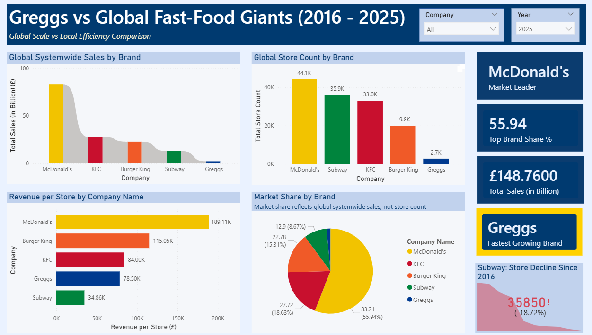
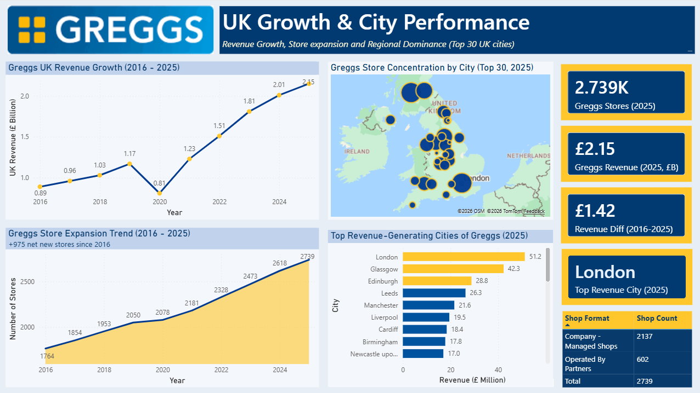
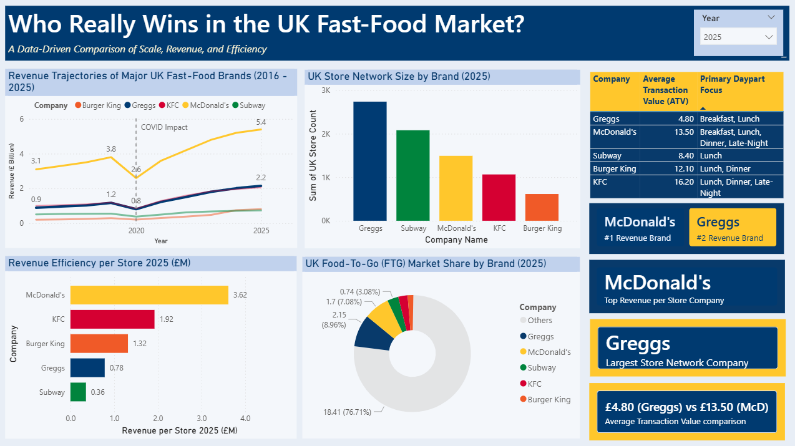
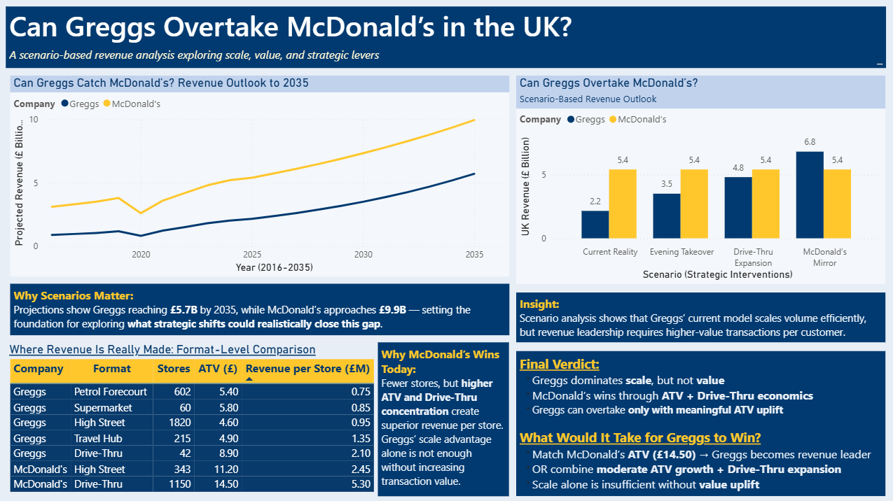

# Greggs vs Global Fast-Food Giants

## Overview

This Power BI project explores Greggs’ position against major fast-food brands and answers a strategic question:

## **Can Greggs overtake McDonald’s in the UK by 2035?**

I started this project from a simple observation: **Greggs is everywhere in the UK**. It feels like one of the most visible food chains on British streets, which naturally raises the question of whether it is also the market leader.

However, after exploring the data, I found that **McDonald’s still leads the UK market by revenue**, while **Greggs is in second place**. That discovery became the foundation of this dashboard. The project then moves from curiosity to analysis: comparing major brands globally, understanding Greggs’ UK growth, identifying why Greggs is still behind McDonald’s, and testing whether Greggs could realistically overtake it by 2035 under different strategic scenarios.

The main finding is that **Greggs dominates scale and presence, but McDonald’s still wins on value** — especially through **higher average transaction value, stronger revenue per store, and better drive-thru economics**.

---

## Main Business Question

Greggs has expanded rapidly across the UK and built one of the country’s largest food-to-go store networks. But despite its visibility and strong revenue growth, it still has not overtaken McDonald’s in UK revenue.

This project investigates:

* who leads the market globally and within the UK
* how Greggs compares in store count, revenue, revenue per store, and market share
* why Greggs is still behind McDonald’s in the UK
* whether Greggs can realistically become the UK revenue leader by 2035

---

## Dashboard Story

### 1. Global Comparison

The first page compares Greggs with major fast-food brands globally using:

* systemwide sales
* global store count
* revenue per store
* market share by brand

This page is designed to create context. Since Greggs feels highly dominant inside the UK, the dashboard first zooms out and compares it with global giants such as McDonald’s, KFC, Burger King, and Subway.

A notable insight from this page is that **Subway’s store network has been shrinking**, while Greggs appears as a much smaller but fast-growing regional player.

---

### 2. Greggs UK Growth & City Performance

The second page focuses entirely on Greggs and shows:

* UK revenue growth from 2016 to 2025
* store expansion trend
* city-level store concentration
* top revenue-generating cities
* store ownership structure

This page helps explain why Greggs has grown so strongly in the UK while still not becoming number one in revenue.

One important insight is that **Greggs mainly operates through company-managed shops rather than relying heavily on franchising**. This gives Greggs strong control over operations and brand consistency, but it also limits how aggressively it can expand compared with franchise-heavy global chains.

---

### 3. UK Market Comparison

The third page compares major brands specifically within the UK market using:

* UK revenue trajectories
* UK store network size
* revenue per store
* food-to-go market share
* average transaction value (ATV)
* daypart focus

This is the core comparison page, and it explains one of the most important reasons why **Greggs is still #2 rather than #1**:

## **Average Transaction Value (ATV)**

Greggs has a very large store network and strong accessibility, but its average transaction value is much lower than McDonald’s. That means even if Greggs serves many customers, the amount spent per visit is still not high enough to match McDonald’s revenue power.

In simple terms:

* **Greggs wins on convenience and presence**
* **McDonald’s wins on value per customer**

---

### 4. Scenario Analysis to 2035

The final page explores whether Greggs can overtake McDonald’s by 2035 under different scenarios:

* current growth trajectory
* evening trade expansion
* drive-thru expansion
* McDonald’s mirror scenario

This page turns the dashboard from a comparison project into a strategic forecasting project.

The analysis suggests that Greggs can continue growing strongly, but **store expansion alone is not enough** to overtake McDonald’s.

Two major barriers stand out:

1. **Greggs cannot suddenly raise prices or ATV too aggressively**, because a big part of its brand identity is affordable, convenient food. A sharp increase could hurt customer loyalty.
2. **Greggs cannot realistically scale drive-thru presence fast enough** to match McDonald’s, especially when McDonald’s already has a mature drive-thru model and Greggs currently has a much smaller base.

This makes **evening trade** the most realistic strategic opportunity. If Greggs improves its evening menu, extends opening hours, and captures more late-day demand, it may narrow the gap more effectively than through price increases or rapid drive-thru expansion.

---

## Key Insights

* McDonald’s is the current UK revenue leader, while Greggs is in second place
* Greggs has achieved strong UK growth and built one of the largest food-to-go store networks
* Greggs feels dominant in physical presence, but that does not automatically translate into revenue leadership
* Greggs’ company-managed model supports control and consistency, but may limit rapid expansion compared with franchise-heavy chains
* The biggest structural reason Greggs is still behind McDonald’s is **low average transaction value**
* McDonald’s also benefits from stronger **revenue per store** and better **drive-thru economics**
* Evening trade appears to be the most realistic growth lever for Greggs going forward

---

## Final Conclusion

This project shows that Greggs is one of the strongest retail growth stories in the UK, but **being everywhere is not the same as being number one in revenue**.

McDonald’s remains ahead because it generates more value per customer and more revenue per store. Greggs cannot easily solve this by sharply increasing prices, because affordability is part of its brand identity. It also cannot realistically solve it by opening huge numbers of drive-thru locations in the near term.

The most realistic path forward is through:

* stronger evening menu strategy
* longer opening hours
* better late-day trading performance

So the final verdict is:

## **Greggs dominates presence, but McDonald’s still dominates value.**

## **If Greggs wants to become #1, evening trade is its best realistic opportunity.**

---

## Tools Used

* **Power BI** for dashboard design, modelling, KPI tracking, and scenario analysis
* **Excel** for structuring source data across multiple sheets

---

## Files Included

* `Greggs vs Global Fast-Food Giants.pbix` - Power BI dashboard
* `Global & UK Fast-Food Performance Data.xlsx` - cleaned source workbook
* `Images/` - screenshots of dashboard pages

---

## Why This Project Matters

This project demonstrates:

* business storytelling with data
* competitor benchmarking
* UK market analysis
* scenario-based forecasting
* translating business intuition into measurable insights
* dashboard design for decision-making

It is designed as a portfolio project for **data analyst, business intelligence, and strategy-focused roles**.
